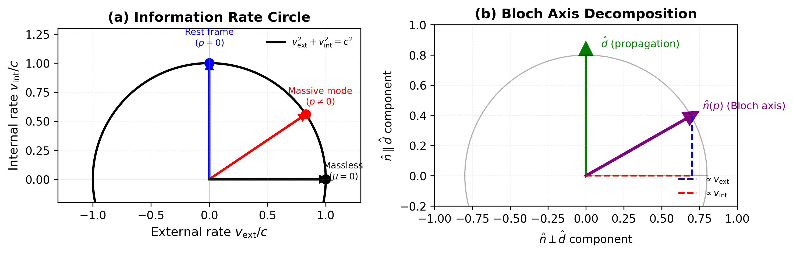
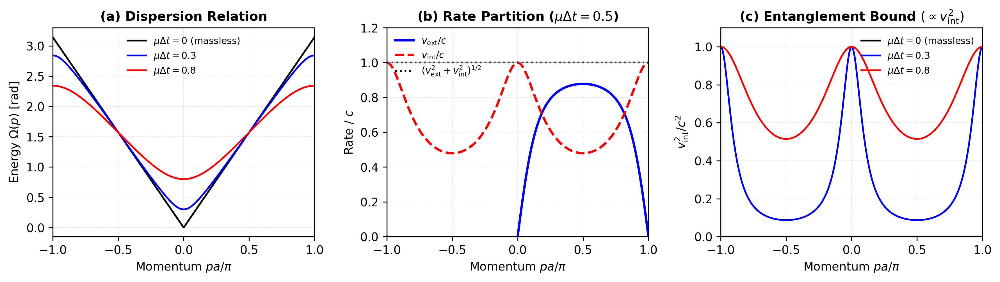

# Information Rate Circle in Dirac Quantum Walks

## Dirac量子行走中的信息率圆

---

<div align="center">


</div>

---

### 📥 Documents / 文档

| 📎 Document | Description |
|-------------|-------------|
| 📄 [**Full Paper (PDF)**](./Information%20rate%20circle%20in%20Dirac%20quantum%20walks.pdf) | Complete manuscript / 完整论文 |
| 🎨 [**Visual Summary (PDF)**](./Spacetime_Emerges_From_Code.pdf) | Infographic presentation / 可视化展示 |

---

### 📄 Abstract / 摘要

**English:**
We identify an exact geometric conservation law for the single-particle sector of one-dimensional Dirac-type quantum cellular automata (QCA): v²_ext(p) + v²_int(p) = c², where v_ext is the group velocity, v_int is an internal rate determined by the Bloch-axis geometry, and c is the Lieb-Robinson causal velocity. This "information rate circle" partitions the maximal causal information flow between spatial transport and internal quantum processing. We prove that v_int sets a rigorous upper bound on coin-position entanglement generation for narrow wave packets. In the long-wavelength limit, interpreting v_int/c as a proper-time rate yields standard special-relativistic kinematics.

**中文:**
我们识别了一维Dirac型量子元胞自动机(QCA)单粒子扇区的精确几何守恒律：v²_ext(p) + v²_int(p) = c²，其中v_ext是群速度，v_int是由Bloch轴几何确定的内部速率，c是Lieb-Robinson因果速度。这个"信息率圆"将最大因果信息流在空间传输和内部量子处理之间进行分配。我们证明v_int为窄波包的硬币-位置纠缠产生设定了严格上界。在长波极限下，将v_int/c解释为固有时速率可得到标准的狭义相对论运动学。

---

### 🎯 Key Contributions / 主要贡献

- **Information Rate Circle** - Exact identity v²_ext + v²_int = c² / 精确恒等式
- **Entanglement Bound** - v_int controls coin-position entanglement / v_int控制硬币-位置纠缠
- **Emergent Relativity** - Time dilation and E²=p²c²+m²c⁴ from QCA geometry / 从QCA几何涌现的相对论
- **Experimental Protocols** - Proposals for trapped-ion and photonic verification / 实验验证方案

---

### 📊 Figures / 图表


*Information rate circle visualization / 信息率圆可视化*


*Dispersion relation and velocity decomposition / 色散关系与速度分解*

---

### 📁 Project Structure / 项目结构

```
PRA-Info-Rate-Circle-Dirac-Quantum-Walks/
├── raw/           # LaTeX source files / LaTeX源文件
├── figure/        # Figures / 图表
├── script/        # Figure generation scripts / 图表生成脚本
├── info.png       # Paper infographic / 论文信息图
└── README.md
```

---

### 🔗 Target Journal / 目标期刊
**Physical Review A**

### 👥 Authors / 作者
- Haobo Ma (Independent Researcher)
- Wenlin Zhang (National University of Singapore)

